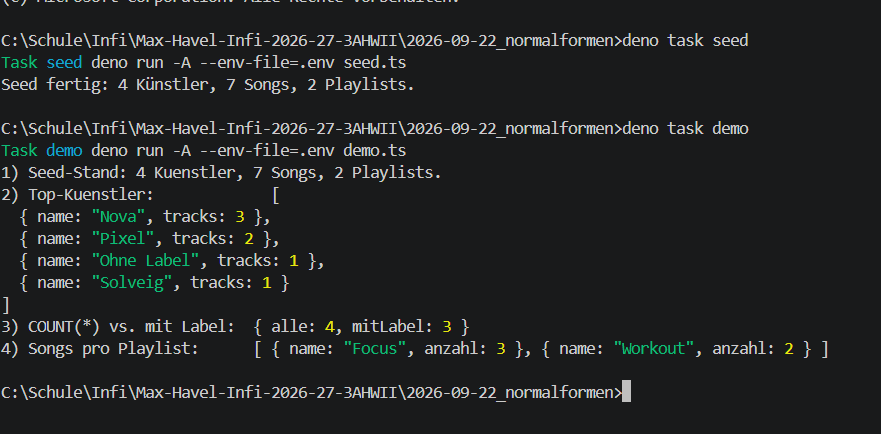

# Abgabe KM5-02 — Normalisierung 1NF–3NF (mit Prisma)

## 1. Vorhersage: welche Spalte von `bestellung_denorm` verletzt welche NF?

Ausgangstabelle (`seed-normalisierung.sql`):

```sql
CREATE TABLE bestellung_denorm(
  bestell_nr INTEGER PRIMARY KEY,
  kunde TEXT NOT NULL, plz TEXT NOT NULL, ort TEXT NOT NULL
);
-- 101 | Auer  | 1020 | Wien
-- 102 | Beck  | 1020 | Wien
-- 103 | Cevik | 4020 | Linz
```

| Spalte | NF-Urteil | Begründung |
|---|---|---|
| `bestell_nr` | ok | PK, eindeutig |
| `kunde` | 1NF+2NF+3NF ok | atomar, `bestell_nr → kunde` (voll + direkt) |
| `plz` | 1NF+2NF+3NF ok | atomar, `bestell_nr → plz` (voll + direkt) |
| `ort` | **verletzt 3NF** | **transitiv:** `bestell_nr → plz → ort`. `1020 → Wien` ist 2x gespeichert. 1NF ok (atomar, keine Liste), 2NF ok (PK einspaltig → keine Teilschlüssel-Abhängigkeit möglich). |

Abhängigkeitspfeile:

```text
bestell_nr ──→ kunde
bestell_nr ──→ plz
plz ──→ ort              ← transit, deshalb 3NF-Verletzung
bestell_nr - - → ort     ← nur indirekt über plz
```

Folgen (Anomalien): Update (Wien umbenennen = 2 Zeilen), Delete (Linz-Bestellung löschen → Wissen `4020 = Linz` weg), Insert (neue PLZ ohne Bestellung nicht speicherbar).

## 2. Zerlegen bis 3NF (mit Pfeil-Begründung je Stufe)

**Stufe 1NF:** Alle Zellen atomar (`'Auer'`, `'1020'`, `'Wien'` — keine Liste wie `'Lesen, Schwimmen'`, keine `track1..track3`-Spalten), PK vorhanden → **bereits 1NF.**

**Stufe 2NF:** PK = nur `bestell_nr`. Partielle Abhängigkeit braucht einen *zusammengesetzten* PK (vgl. `song_playlist_denorm`) → **bereits 2NF.**

**Stufe 3NF:** `ort` hängt von Nichtschlüssel `plz` ab → auslagern:

```sql
CREATE TABLE plz(plz TEXT PRIMARY KEY, ort TEXT NOT NULL);
INSERT INTO plz VALUES ('1020','Wien'), ('4020','Linz');
CREATE TABLE bestellung(
  bestell_nr INTEGER PRIMARY KEY,
  kunde TEXT NOT NULL,
  plz TEXT NOT NULL REFERENCES plz(plz)
);
INSERT INTO bestellung VALUES (101,'Auer','1020'), (102,'Beck','1020'), (103,'Cevik','4020');
```

Neue Pfeile (kein Transit mehr):

```text
plz ──→ ort
bestell_nr ──→ kunde
bestell_nr ──→ plz (FK)
```

**Prisma:**

```prisma
model Plz {
  plz          String       @id
  ort          String
  bestellungen Bestellung[]
}
model Bestellung {
  bestellNr Int    @id @map("bestell_nr")
  kunde     String
  plz       String
  plzRef    Plz    @relation(fields: [plz], references: [plz])
}
```

→ `Wien` steht nur 1x in `plz`, `bestellung` verweist per FK. Alle 3 Anomalien behoben.

## 3. Zwei eigene Tabellen (SQL-CREATEs + je 3 Beispielzeilen)

Vollständige Skripte in `abgabe-3nf.sql`. Hier die Kurzfassung:

### 3a) `kunde_hobby_denorm` → 1NF-Verletzung (Liste in Zelle)

Problem: `hobbys = 'Lesen, Schwimmen'` ist nicht atomar. Pfeil: `kunde_id → name` ok, aber `kunde_id -/-> hobbys` (mehrwertig).

```sql
CREATE TABLE kunde(kunde_id INTEGER PRIMARY KEY, name TEXT NOT NULL);
CREATE TABLE hobby(kunde_id INTEGER REFERENCES kunde(kunde_id), hobby TEXT NOT NULL, PRIMARY KEY(kunde_id, hobby));
INSERT INTO kunde VALUES (1,'Auer'), (2,'Beck'), (3,'Cevik');
INSERT INTO hobby VALUES (1,'Lesen'), (1,'Schwimmen'), (2,'Schach');
```

Prisma: `Kunde 1—n Hobby` (`@@id([kundeId, hobby])`).

### 3b) `song_playlist_denorm` → 2NF-Verletzung (Teilschlüssel-Abhängigkeit)

Problem: PK = `(song_id, playlist_id)`, aber `song_id → song_titel` (Teil des PK). `'Silent Lines'` 2x gespeichert.

```sql
CREATE TABLE song(song_id INTEGER PRIMARY KEY, titel TEXT NOT NULL, dauer_sek INT NOT NULL);
CREATE TABLE playlist(playlist_id INTEGER PRIMARY KEY, name TEXT NOT NULL);
CREATE TABLE song_playlist(song_id INT REFERENCES song(song_id), playlist_id INT REFERENCES playlist(playlist_id), PRIMARY KEY(song_id, playlist_id));
INSERT INTO song VALUES (1,'Silent Lines',215), (2,'Night Ferry',240), (3,'Dust Choir',198);
INSERT INTO playlist VALUES (10,'Fokus'), (20,'Nachtfahrt'), (30,'Sport');
INSERT INTO song_playlist VALUES (1,10), (1,20), (2,20);
```

Prisma: entspricht dem Projekt-Schema — `Song { playlists Playlist[] }` / `Playlist { songs Song[] }`. Prisma erzeugt die Zwischentabelle automatisch = 2NF-Fix per ORM.

## 4. Demo laufen lassen: `deno task demo` (4 Konsolenzeilen)

Befehl (im Ordner `2026-09-22_normalformen/`):

```powershell
deno task seed
deno task demo
```

`demo` ist in `deno.json` eingetragen (`demo.ts` = nur lesend, idempotent) und gibt **genau 4 Zeilen** aus. Echte Ausgabe vom 08.10.2026 (verifiziert, `deno test` = 5 passed):

```text
1) Seed-Stand: 4 Kuenstler, 7 Songs, 2 Playlists.
2) Top-Kuenstler:             [ { name: "Nova", tracks: 3 }, { name: "Pixel", tracks: 2 }, { name: "Ohne Label", tracks: 1 }, { name: "Solveig", tracks: 1 } ]
3) COUNT(*) vs. mit Label:  { alle: 4, mitLabel: 3 }
4) Songs pro Playlist:      [ { name: "Focus", anzahl: 3 }, { name: "Workout", anzahl: 2 } ]
```

Was jede Zeile beweist: (1) Seed ok, (2) `GROUP BY kuenstlerId` über FK statt kopiertem Namen = 2NF, (3) `labelId NULL` (Künstler ohne Label) = 3NF mit optionalem FK, (4) N:M `Song ↔ Playlist` ohne Redundanz = 2NF.

**Screenshot:** 

